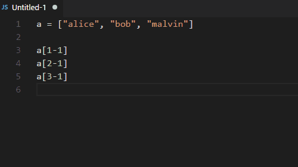

# Evaluate selection in-place

Evaluate selection **in-place** using safeEval in vscode.

## Commands

- Evaluate selection in-place
- Evaluate selection for later use

## Links

- [Github](https://github.com/cprogrammer1994/vscode-evaluate-selection-inplace)
- [Download page](https://marketplace.visualstudio.com/items?itemName=cprogrammer1994.eval-selection)
- [Change log](CHANGELOG.md)
